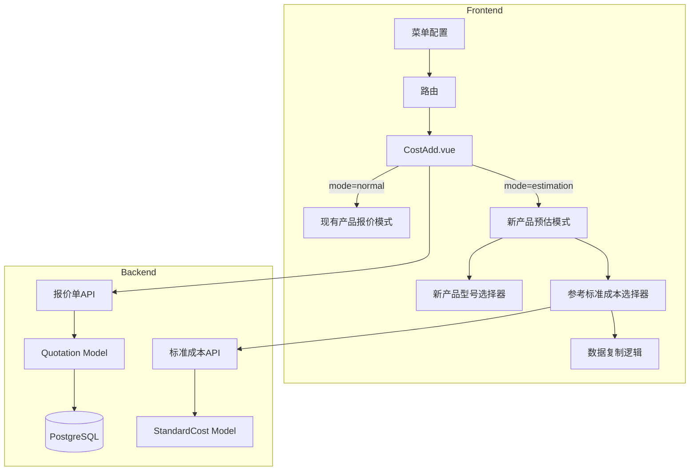

# Design Document: 新产品成本预估

## Overview

本功能在现有的成本新增页面（CostAdd.vue）基础上，通过 URL 参数 `mode=estimation` 切换到"新产品成本预估"模式。该模式下，用户可以选择新产品型号和参考标准成本，系统自动复制参考数据到成本明细，用户在此基础上调整形成新产品的成本预估。

## Architecture



## Components and Interfaces

### 1. 菜单配置变更

**文件**: `frontend/src/config/menuConfig.js`

```javascript
// 修改前
{ id: 'cost_add', label: '新增报价', route: '/cost/add', icon: 'ri-add-circle-line' }

// 修改后
{
  id: 'cost_add',
  label: '新增报价',
  icon: 'ri-add-circle-line',
  children: [
    { id: 'cost_add_normal', label: '现有产品报价', route: '/cost/add' },
    { id: 'cost_add_estimation', label: '新产品成本预估', route: '/cost/add?mode=estimation' }
  ]
}
```

### 2. CostAdd.vue 组件变更

**新增响应式变量**:
```javascript
const isEstimationMode = computed(() => route.query.mode === 'estimation')
const selectedNewModelId = ref(null)           // 新产品型号ID
const referenceStandardCostId = ref(null)      // 参考标准成本ID
const referenceStandardCostInfo = ref(null)    // 参考标准成本摘要信息
```

**新增方法**:
```javascript
// 加载同法规同分类的标准成本列表
async function loadReferenceStandardCosts(regulationId, modelCategory)

// 选择参考标准成本后复制数据
async function onReferenceStandardCostSelect(standardCostId)

// 标记数据行来源
function markItemAsFromReference(item)
```

### 3. 后端 API 变更

**报价单创建/更新接口**:
- 新增字段: `is_estimation` (boolean)
- 新增字段: `reference_standard_cost_id` (integer, nullable)

**标准成本查询接口**:
- 新增筛选参数: `regulation_id`, `model_category`

## Data Models

### 数据库变更

**quotations 表新增字段**:
```sql
ALTER TABLE quotations ADD COLUMN is_estimation BOOLEAN DEFAULT false;
ALTER TABLE quotations ADD COLUMN reference_standard_cost_id INTEGER REFERENCES standard_costs(id);
CREATE INDEX idx_quotations_is_estimation ON quotations(is_estimation);
```

### 前端数据结构

**参考标准成本摘要**:
```typescript
interface ReferenceStandardCostInfo {
  id: number
  model_name: string
  model_category: string
  config_name: string
  packaging_type: string
  base_cost: number
  overhead_price: number
  quantity: number
}
```

**成本明细项扩展**:
```typescript
interface CostItem {
  // 现有字段...
  from_reference: boolean    // 是否来自参考标准成本
  is_modified: boolean       // 是否已被修改
  original_value: number     // 原始值（用于重置）
}
```

## Correctness Properties

*A property is a characteristic or behavior that should hold true across all valid executions of a system-essentially, a formal statement about what the system should do. Properties serve as the bridge between human-readable specifications and machine-verifiable correctness guarantees.*

### Property 1: 标准成本筛选正确性

*For any* 新产品型号（具有特定法规ID和分类），参考标准成本选择器返回的所有标准成本记录都应该属于同一法规ID和同一分类。

**Validates: Requirements 2.2, 3.2**

### Property 2: 数据复制完整性

*For any* 参考标准成本，复制到成本明细后：
- 原料、工序、包材的数量应与参考标准成本一致
- 每个复制的数据行都应标记 `from_reference = true`
- 成本汇总应正确计算

**Validates: Requirements 4.1, 4.2, 4.4**

### Property 3: 搜索结果正确性

*For any* 搜索关键词，参考标准成本搜索结果中的所有记录的型号名称都应包含该关键词（不区分大小写）。

**Validates: Requirements 3.4**

## Error Handling

| 场景 | 处理方式 |
|------|----------|
| 未选择新产品型号就选择参考标准成本 | 禁用参考标准成本选择器 |
| 同法规同分类下无可用标准成本 | 显示提示信息，允许从空白开始 |
| 参考标准成本加载失败 | 显示错误提示，允许重试 |
| 数据复制过程中断 | 回滚到复制前状态 |

## Testing Strategy

### 单元测试

1. **菜单配置测试**: 验证菜单结构正确
2. **筛选逻辑测试**: 验证标准成本筛选逻辑
3. **数据复制测试**: 验证数据复制的完整性

### 属性测试

使用 fast-check 库进行属性测试：

1. **Property 1**: 生成随机法规ID和分类，验证筛选结果
2. **Property 2**: 生成随机标准成本数据，验证复制完整性
3. **Property 3**: 生成随机搜索关键词，验证搜索结果

### 集成测试

1. 完整流程测试：从菜单入口到保存报价单
2. 数据持久化测试：验证 `is_estimation` 和 `reference_standard_cost_id` 正确存储
