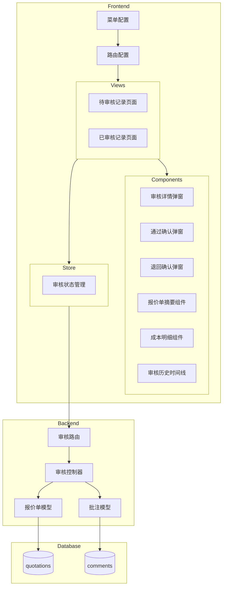

# 报价单审核流程 - 设计文档

## Overview

本设计文档描述报价单审核流程功能的技术实现方案。该功能为成本分析管理系统补全审核流程，实现报价单的状态流转、差异高亮、批注功能和审核记录追溯。

### 核心功能
- 待审核记录列表（仅显示"已提交"状态）
- 已审核记录列表（显示"已通过"和"已退回"状态）
- 审核详情弹窗（完整视图/简略视图）
- 审核操作（通过/退回）
- 业务员退回处理（查看、编辑、重新提交）
- 角色权限控制

### 技术栈
- 前端：Vue 3 + Element Plus + Pinia
- 后端：Node.js + Express + PostgreSQL
- 现有数据库已预留审核相关字段

## Architecture



## Components and Interfaces

### 前端组件结构

```
frontend/src/
├── views/
│   └── review/
│       ├── PendingReview.vue      # 待审核记录页面
│       └── ApprovedReview.vue     # 已审核记录页面
├── components/
│   └── review/
│       ├── ReviewDetailDialog.vue  # 审核详情弹窗（完整视图）
│       ├── ApprovedDetailDialog.vue # 已审核详情弹窗（简略视图）
│       ├── ApproveConfirmDialog.vue # 通过确认弹窗
│       ├── RejectConfirmDialog.vue  # 退回确认弹窗
│       ├── ResubmitConfirmDialog.vue # 重新提交确认弹窗
│       ├── QuotationSummary.vue    # 报价单摘要组件
│       ├── CostDetailTabs.vue      # 成本明细Tab组件
│       ├── DiffHighlightRow.vue    # 差异高亮行组件
│       ├── ReviewTimeline.vue      # 审核历史时间线
│       └── ProfitPricing.vue       # 利润区间报价组件
├── store/
│   └── review.js                   # 审核状态管理
└── config/
    └── menuConfig.js               # 菜单配置（更新）
```

### 后端接口设计

#### 1. 获取待审核列表
```
GET /api/review/pending
Query: { customer_name?, model_name?, start_date?, end_date?, page?, page_size? }
Response: { data: Quotation[], total: number, page: number }
```

#### 2. 获取已审核列表
```
GET /api/review/approved
Query: { status?, customer_name?, model_name?, start_date?, end_date?, page?, page_size? }
Response: { data: Quotation[], total: number, page: number }
```

#### 3. 获取报价单详情（审核视图）
```
GET /api/review/:id/detail
Response: { quotation: Quotation, items: QuotationItem[], standardItems: StandardItem[], comments: Comment[] }
```

#### 4. 审核通过
```
POST /api/review/:id/approve
Body: { comment?: string }
Response: { success: boolean, message: string }
```

#### 5. 审核退回
```
POST /api/review/:id/reject
Body: { reason: string }
Response: { success: boolean, message: string }
```

#### 6. 重新提交
```
POST /api/review/:id/resubmit
Response: { success: boolean, message: string }
```

#### 7. 删除报价单（仅管理员）
```
DELETE /api/review/:id
Response: { success: boolean, message: string }
```

### 组件接口定义

#### ReviewDetailDialog.vue
```typescript
interface Props {
  visible: boolean
  quotationId: number
}

interface Emits {
  (e: 'update:visible', value: boolean): void
  (e: 'approved'): void
  (e: 'rejected'): void
}
```

#### QuotationSummary.vue
```typescript
interface Props {
  quotation: Quotation
  viewMode: 'full' | 'simple'  // 完整视图/简略视图
  showProfitPricing: boolean
}
```

#### CostDetailTabs.vue
```typescript
interface Props {
  items: QuotationItem[]
  standardItems: StandardItem[]
  showDiff: boolean
  editable: boolean
}

interface Emits {
  (e: 'item-change', item: QuotationItem): void
  (e: 'item-add', category: string): void
  (e: 'item-delete', itemId: number): void
}
```

## Data Models

### 现有数据库表（已存在）

#### quotations 表
```sql
-- 关键字段
status VARCHAR(20) -- 'draft', 'submitted', 'approved', 'rejected'
reviewed_by INTEGER REFERENCES users(id)
reviewed_at TIMESTAMP
submitted_at TIMESTAMP
```

#### quotation_items 表
```sql
-- 关键字段
is_changed BOOLEAN DEFAULT false  -- 是否被修改
original_value DECIMAL(12,4)      -- 原始值（用于差异对比）
```

#### comments 表
```sql
-- 用于存储审核批注和退回原因
quotation_id INTEGER
user_id INTEGER
content TEXT
created_at TIMESTAMP
```

### 新增数据库表

#### review_history 表（审核历史）
```sql
CREATE TABLE IF NOT EXISTS review_history (
  id SERIAL PRIMARY KEY,
  quotation_id INTEGER NOT NULL REFERENCES quotations(id) ON DELETE CASCADE,
  action VARCHAR(20) NOT NULL CHECK(action IN ('created', 'submitted', 'approved', 'rejected', 'resubmitted')),
  operator_id INTEGER NOT NULL REFERENCES users(id),
  comment TEXT,
  created_at TIMESTAMP DEFAULT NOW()
);

CREATE INDEX idx_review_history_quotation ON review_history(quotation_id);
```

### 前端数据模型

```typescript
interface Quotation {
  id: number
  quotation_no: string
  customer_name: string
  customer_region: string
  model_id: number
  model_name: string
  regulation_name: string
  quantity: number
  sales_type: 'domestic' | 'export'
  base_cost: number
  overhead_price: number
  final_price: number
  currency: string
  status: 'draft' | 'submitted' | 'approved' | 'rejected'
  created_by: number
  creator_name: string
  reviewed_by: number | null
  reviewer_name: string | null
  created_at: string
  submitted_at: string | null
  reviewed_at: string | null
  packaging_config: PackagingConfig
}

interface QuotationItem {
  id: number
  category: 'material' | 'process' | 'packaging'
  item_name: string
  usage_amount: number
  unit_price: number
  subtotal: number
  is_changed: boolean
  original_value: number | null
  diff_status: 'unchanged' | 'modified' | 'added' | 'deleted'
}

interface ReviewHistory {
  id: number
  action: 'created' | 'submitted' | 'approved' | 'rejected' | 'resubmitted'
  operator_name: string
  comment: string | null
  created_at: string
}

interface ProfitPricing {
  rate: number      // 5, 10, 25, 50
  price: number
  currency: string
}
```

## Correctness Properties

*A property is a characteristic or behavior that should hold true across all valid executions of a system-essentially, a formal statement about what the system should do. Properties serve as the bridge between human-readable specifications and machine-verifiable correctness guarantees.*

### Property 1: 待审核列表状态过滤
*For any* 待审核记录列表请求，返回的所有报价单状态都应该是"submitted"（已提交）
**Validates: Requirements 1.1**

### Property 2: 已审核列表状态过滤
*For any* 已审核记录列表请求，返回的所有报价单状态都应该是"approved"（已通过）或"rejected"（已退回）
**Validates: Requirements 2.1**

### Property 3: 审核通过状态转换
*For any* 状态为"submitted"的报价单，执行审核通过操作后，状态应变为"approved"，且reviewed_by和reviewed_at字段应被正确设置
**Validates: Requirements 4.5, 4.6**

### Property 4: 审核退回状态转换
*For any* 状态为"submitted"的报价单，执行审核退回操作后，状态应变为"rejected"，且退回原因应被记录到comments表
**Validates: Requirements 5.6, 5.7**

### Property 5: 重新提交状态转换
*For any* 状态为"rejected"的报价单，执行重新提交操作后，状态应变为"submitted"，且审核历史应保留完整链条
**Validates: Requirements 9.3, 9.4**

### Property 6: 角色权限控制 - 菜单可见性
*For any* 用户角色，审核管理菜单组仅对"admin"和"reviewer"角色可见，对"salesperson"和"readonly"角色隐藏
**Validates: Requirements 11.4, 11.5**

### Property 7: 角色权限控制 - 删除按钮
*For any* 报价单列表页面，删除按钮仅对"admin"角色可见，对其他角色隐藏
**Validates: Requirements 1.5, 2.7, 12.1, 12.2**

### Property 8: 筛选功能正确性
*For any* 筛选条件（客户名称、型号、日期范围），返回的所有报价单都应满足该筛选条件
**Validates: Requirements 1.3, 2.5**

### Property 9: 退回原因必填验证
*For any* 审核退回操作，如果退回原因为空，操作应被阻止并返回错误
**Validates: Requirements 5.5**

### Property 10: 编辑权限 - 单价只读
*For any* 业务员编辑退回报价单时，单价字段应为只读状态，仅用量字段可编辑
**Validates: Requirements 8.3, 8.4**

## Error Handling

### 前端错误处理

| 错误场景 | 处理方式 |
|---------|---------|
| API请求失败 | 显示Element Plus的ElMessage错误提示 |
| 权限不足 | 重定向到403页面或显示无权限提示 |
| 数据加载失败 | 显示空状态组件，提供重试按钮 |
| 表单验证失败 | 高亮错误字段，显示验证错误信息 |
| 网络超时 | 显示网络错误提示，提供重试选项 |

### 后端错误处理

| 错误场景 | HTTP状态码 | 错误信息 |
|---------|-----------|---------|
| 报价单不存在 | 404 | 报价单不存在 |
| 状态不允许操作 | 400 | 当前状态不允许此操作 |
| 权限不足 | 403 | 无权限执行此操作 |
| 退回原因为空 | 400 | 请输入退回原因 |
| 数据库错误 | 500 | 服务器内部错误 |

### 错误码定义

```javascript
const ReviewErrorCodes = {
  QUOTATION_NOT_FOUND: 'REVIEW_001',
  INVALID_STATUS: 'REVIEW_002',
  PERMISSION_DENIED: 'REVIEW_003',
  REJECT_REASON_REQUIRED: 'REVIEW_004',
  DATABASE_ERROR: 'REVIEW_005'
}
```

## Testing Strategy

### 单元测试

使用 Vitest 进行单元测试：

1. **组件测试**
   - QuotationSummary组件渲染测试
   - CostDetailTabs组件交互测试
   - ReviewTimeline组件数据展示测试

2. **Store测试**
   - review store的状态管理测试
   - API调用mock测试

3. **工具函数测试**
   - 差异计算函数测试
   - 利润报价计算函数测试
   - 日期格式化函数测试

### 属性测试

使用 fast-check 进行属性测试：

1. **列表过滤属性测试**
   - 验证待审核列表只返回submitted状态
   - 验证已审核列表只返回approved/rejected状态

2. **状态转换属性测试**
   - 验证审核通过后状态正确转换
   - 验证审核退回后状态正确转换
   - 验证重新提交后状态正确转换

3. **权限控制属性测试**
   - 验证不同角色的菜单可见性
   - 验证不同角色的操作按钮可见性

### 集成测试

1. **API集成测试**
   - 审核流程完整流程测试
   - 权限控制端到端测试

2. **E2E测试**
   - 审核人审核通过流程
   - 审核人审核退回流程
   - 业务员重新提交流程

### 测试框架配置

```javascript
// vitest.config.js
export default {
  test: {
    environment: 'jsdom',
    globals: true,
    coverage: {
      provider: 'v8',
      reporter: ['text', 'json', 'html']
    }
  }
}
```

### 属性测试示例

```javascript
// 使用 fast-check 进行属性测试
import * as fc from 'fast-check'

// Property 1: 待审核列表状态过滤
// **Feature: quotation-review, Property 1: 待审核列表状态过滤**
test('pending list should only contain submitted quotations', async () => {
  await fc.assert(
    fc.asyncProperty(
      fc.array(quotationArbitrary, { minLength: 1, maxLength: 100 }),
      async (quotations) => {
        // Setup: 插入测试数据
        await insertTestQuotations(quotations)
        
        // Action: 获取待审核列表
        const result = await getPendingList()
        
        // Assert: 所有返回的报价单状态都是submitted
        return result.every(q => q.status === 'submitted')
      }
    ),
    { numRuns: 100 }
  )
})
```
