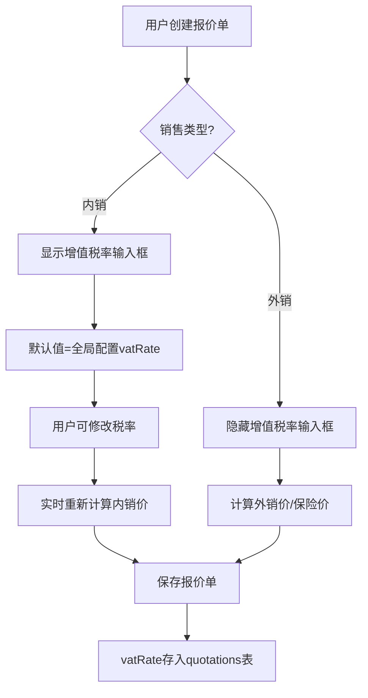
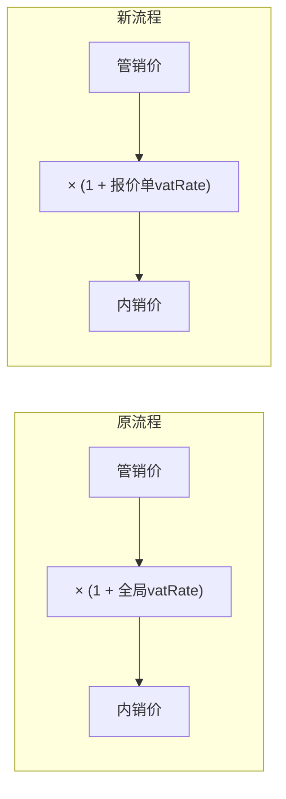

# Design Document: 报价单增值税率覆盖功能

## Overview

本功能在报价单级别支持自定义增值税率，允许用户在创建内销报价单时覆盖系统全局配置的增值税率（默认13%）。这解决了不同产品或客户需要使用不同税率（如10%）的业务需求，同时保持全局配置作为默认值的便利性。

## Architecture

### 数据流



### 计算流程变更



## Components and Interfaces

### 1. 数据库层

**新增字段**: `quotations.vat_rate`

```sql
-- 迁移脚本: 014_add_vat_rate_to_quotations.sql
ALTER TABLE quotations ADD COLUMN vat_rate REAL DEFAULT NULL;
```

- 类型: `REAL`
- 默认值: `NULL`（表示使用全局配置）
- 约束: 值必须在 0 到 1 之间

### 2. 后端 API 层

**修改文件**: `backend/controllers/costController.js`

#### 2.1 createQuotation 接口变更

```javascript
// 新增请求参数
{
  vat_rate: number | null  // 可选，0-1之间的小数
}

// 计算逻辑变更
const calculatorConfig = SystemConfig.getCalculatorConfig();
// 如果请求中包含vat_rate，覆盖全局配置
if (req.body.vat_rate !== undefined && req.body.vat_rate !== null) {
  calculatorConfig.vatRate = req.body.vat_rate;
}
const calculator = new CostCalculator(calculatorConfig);
```

#### 2.2 updateQuotation 接口变更

同 createQuotation，支持更新 vat_rate 字段。

#### 2.3 getQuotationDetail 接口变更

返回数据中包含 `vat_rate` 字段，用于详情页显示。

### 3. 后端 Model 层

**修改文件**: `backend/models/Quotation.js`

```javascript
// create 方法新增 vat_rate 字段
static create(data) {
  // ... 现有字段
  vat_rate: data.vat_rate || null
}

// update 方法 allowedFields 新增
const allowedFields = [
  // ... 现有字段
  'vat_rate'
];
```

### 4. 前端组件层

**修改文件**: `frontend/src/views/cost/CostAdd.vue`

#### 4.1 表单数据新增

```javascript
const form = reactive({
  // ... 现有字段
  vat_rate: null  // 增值税率，null表示使用全局配置
})
```

#### 4.2 UI 组件

```vue
<!-- 增值税率输入框，仅内销时显示 -->
<el-col :span="8" v-if="form.sales_type === 'domestic'">
  <el-form-item label="增值税率" prop="vat_rate">
    <el-input-number
      v-model="form.vat_rate"
      :min="0"
      :max="1"
      :precision="2"
      :step="0.01"
      @change="calculateCost"
      style="width: 100%"
    />
    <div style="color: #909399; font-size: 12px;">
      当前: {{ (form.vat_rate * 100).toFixed(0) }}%，系统默认: {{ (configStore.config.vat_rate * 100).toFixed(0) }}%
    </div>
  </el-form-item>
</el-col>
```

#### 4.3 动态标签显示

```vue
<!-- 成本计算结果中的动态标签 -->
<el-descriptions-item 
  :label="form.sales_type === 'domestic' 
    ? `最终成本价（含${(form.vat_rate * 100).toFixed(0)}%增值税）` 
    : '最终成本价（不含增值税）'"
>
```

**修改文件**: `frontend/src/views/cost/CostDetail.vue`

同样更新详情页的标签显示逻辑。

## Data Models

### quotations 表结构变更

| 字段名 | 类型 | 说明 |
|--------|------|------|
| vat_rate | REAL | 增值税率，NULL表示使用全局配置，0-1之间的小数 |

### API 请求/响应模型

```typescript
// 创建/更新报价单请求
interface QuotationRequest {
  // ... 现有字段
  vat_rate?: number;  // 可选，0-1之间
}

// 报价单详情响应
interface QuotationResponse {
  // ... 现有字段
  vat_rate: number | null;  // 实际使用的税率
}

// 计算结果响应
interface CalculationResponse {
  // ... 现有字段
  vatRate: number;  // 实际使用的税率（用于前端显示）
}
```

## Correctness Properties

*A property is a characteristic or behavior that should hold true across all valid executions of a system-essentially, a formal statement about what the system should do. Properties serve as the bridge between human-readable specifications and machine-verifiable correctness guarantees.*

### Property Reflection

分析 prework 中识别的属性：
- 1.2 和 2.1/2.2 都涉及增值税率计算，可以合并为一个综合的计算正确性属性
- 1.3 是输入验证，独立属性
- 1.4 和 4.2 都涉及数据持久化和隔离，可以合并为 round-trip 属性
- 3.2 是外销计算独立性，独立属性
- 4.1 是默认值继承，独立属性

### Property 1: 内销价格计算正确性

*For any* 有效的管销价（overheadPrice > 0）和有效的增值税率（0 ≤ vatRate ≤ 1），内销价格应该等于 `overheadPrice × (1 + vatRate)`，且显示的税率百分比应该等于 `vatRate × 100`。

**Validates: Requirements 1.2, 2.1, 2.2**

### Property 2: 增值税率验证

*For any* 增值税率输入值，当值小于 0 或大于 1 时，系统应该拒绝保存并返回验证错误。

**Validates: Requirements 1.3**

### Property 3: 增值税率持久化 Round-Trip

*For any* 有效的增值税率（0 ≤ vatRate ≤ 1），保存报价单后再读取，返回的 vat_rate 值应该与保存时的值相等。

**Validates: Requirements 1.4, 4.2**

### Property 4: 外销计算独立性

*For any* 外销报价单和任意增值税率值，最终价格（insurancePrice）应该只与管销价、汇率和保险率相关，与增值税率无关。

**Validates: Requirements 3.2**

### Property 5: 全局配置默认值继承

*For any* 全局增值税率配置值，新创建的内销报价单的默认增值税率应该等于该全局配置值。

**Validates: Requirements 4.1**

## Error Handling

| 错误场景 | 处理方式 | 用户提示 |
|----------|----------|----------|
| vat_rate < 0 或 > 1 | 前端验证 + 后端验证 | "增值税率必须在 0 到 1 之间" |
| vat_rate 非数字 | 前端类型转换 | 输入框只允许数字 |
| 数据库迁移失败 | 回滚事务 | 管理员日志记录 |
| 旧报价单 vat_rate 为 NULL | 使用全局配置值显示 | 显示"（使用系统默认）" |

## Testing Strategy

### 单元测试

使用 Jest 进行单元测试：

1. **CostCalculator 测试**
   - 测试不同 vatRate 值的内销价格计算
   - 测试 vatRate 边界值（0, 0.13, 1）

2. **Quotation Model 测试**
   - 测试 create 方法正确保存 vat_rate
   - 测试 update 方法正确更新 vat_rate
   - 测试 findById 正确返回 vat_rate

### 属性测试

使用 fast-check 进行属性测试：

```javascript
// 示例：Property 1 - 内销价格计算正确性
fc.assert(
  fc.property(
    fc.float({ min: 0.01, max: 10000 }),  // overheadPrice
    fc.float({ min: 0, max: 1 }),          // vatRate
    (overheadPrice, vatRate) => {
      const calculator = new CostCalculator({ vatRate });
      const domesticPrice = calculator.calculateDomesticPrice(overheadPrice);
      const expected = overheadPrice * (1 + vatRate);
      return Math.abs(domesticPrice - expected) < 0.0001;
    }
  )
);
```

### 集成测试

1. **API 集成测试**
   - 创建报价单时传入自定义 vat_rate
   - 更新报价单的 vat_rate
   - 查询报价单详情验证 vat_rate 返回

2. **前端 E2E 测试**（可选）
   - 内销报价单创建流程
   - 税率修改后价格实时更新
   - 详情页显示正确税率
