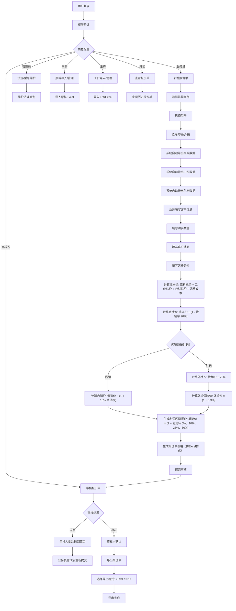

```mermaid
graph TD
    A[用户登录] --> B[权限验证]
    B --> C{角色检查}
    C -->|管理员| D[法规/型号维护]
    C -->|采购| E[原料导入/管理]
    C -->|生产| F[工价导入/管理]
    C -->|业务员| G[新增报价单]
    C -->|审核人| H[审核报价单]
    C -->|只读| I[查看报价单]

    G --> J[选择法规类别]
    J --> K[选择型号]
    K --> L[选择内销/外销]
    L --> M[系统自动带出原料数据]
    M --> N[系统自动带出工价数据]
    N --> O[系统自动带出包材数据]
    O --> P[业务填写客户信息]
    P --> Q[填写购买数量]
    Q --> R[填写客户地区]
    R --> S[填写运费总价]

    S --> T[计算成本价: 原料总价 + 工价总价 + 包材总价 + 运费成本]
    T --> U["计算管销价: 成本价 ÷ (1 - 管销率 20%)"]
    U --> V{内销还是外销?}
    V -->|内销| W["计算内销价: 管销价 × (1 + 13% 增值税)"]
    V -->|外销| X["计算外销价: 管销价 ÷ 汇率"]
    X --> Y["计算外销保险价: 外销价 × (1 + 0.3%)"]

    W --> Z["生成利润区间报价: 基础价 × (1 + 利润% 5%、10%、25%、50%)"]
    Y --> Z
    Z --> AA[生成报价单表格（仿Excel样式）]
    AA --> BB[提交审核]

    BB --> H
    H --> CC{审核结果}
    CC -->|通过| DD[审核人确认]
    CC -->|退回| EE[审核人批注退回原因]
    EE --> FF[业务员修改后重新提交]

    DD --> GG[导出报价单]
    GG --> HH[选择导出格式: XLSX / PDF]
    HH --> II[导出完成]

    D --> JJ[维护法规类别]
    E --> KK[导入原料Excel]
    F --> LL[导入工价Excel]
    I --> MM[查看历史报价单]
```
